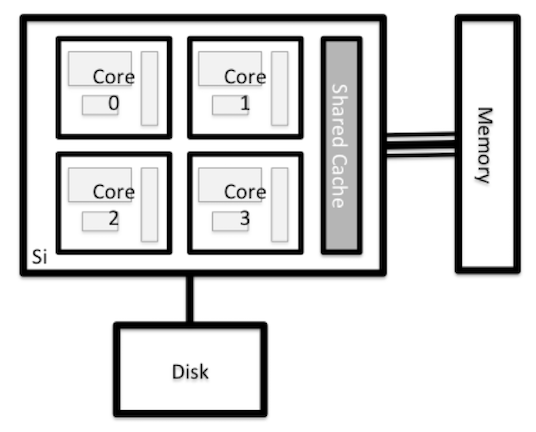

# Introduction to HPC at UM for SC2

The purpose of this presentation is to provide a quick overview of what
HPC and HTC is, system components, and how to find software to run.  We
will use two Python scripts from a prior SC2 workshop to illustrate.

## Cluster components

The cluster is made up of nodes that perform various functions; the
following diagram shows a generic cluster configuration.

As you can see, the point of contact is a login node of some type.  Flux
has two types, one for interactive commands and one only for data
transfer commands.

There is storage space that is shared among the login (including data
transfer) and compute nodes, so files you see from a login node are
also visible from compute nodes.

## Nodes

We call specific physical machines _nodes_, and there are three types of
which you should be aware:  login, data transfer, and compute.

Nodes typically look something like this,

only most of our nodes have at least eight cores per CPU and most nodes
have two CPU sockets.

